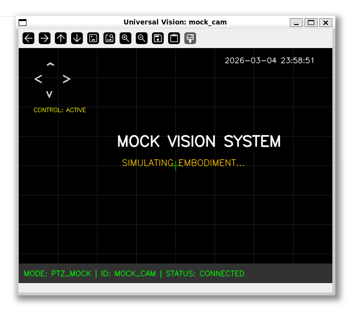

# Universal Vision MCP 👁️

> **「あなたの AI に、本物の『目』と『首』を。」**

Universal Vision MCP は、あなたのパソコンに繋がったカメラを、AI（Claude など）が直接操作できるようにするためのツールです。
これを使うと、AI はあなたの周りの景色を見たり、ネットワークカメラの首を振って辺りを見渡したりできるようになります。

## 🌟 なにができるの？


<br>*(AI がカメラを通じて世界を見ているときのイメージ)*

- **いろんなカメラに対応**: パソコン内蔵のカメラ、USB カメラ、そしてネットワーク上の防犯カメラ（RTSP/ONVIF）まで、AI が同じように扱えます。
- **AI が「自分の体」を理解**: AI は自分が「首を振れるカメラ（PTZ）」なのか「固定されたカメラ」なのかを自分で理解して行動します。
- **自動で見つける**: AI がお家の中のネットワークをスキャンして、新しいカメラを自分で見つけるお手伝いもしてくれます。
- **ライブ表示**: AI に「カメラを見せて」と頼むと、あなたの画面にリアルタイムの映像ウィンドウを表示します。

## 🚀 かんたんな始め方（Claude Desktop で使う）

難しいプログラムのダウンロードや設定は不要です。以下の手順ですぐに始められます。

### 1. [uv](https://docs.astral.sh/uv/) のインストール
まずは、このツールを動かすための軽量な実行環境 `uv` を入れます（たった 1 行です）。

**Windows (PowerShell):**
```powershell
powershell -ExecutionPolicy ByPass -c "irm https://astral.sh/uv/install.ps1 | iex"
```

**macOS / Linux:**
```bash
curl -LsSf https://astral.sh/uv/install.sh | sh
```

### 2. Claude Desktop への登録
次に、以下のコマンドをターミナル（黒い画面）で実行してください。これだけで Claude に「目」が追加されます。

```bash
uvx --from git+https://github.com/utenadev/universal-vision-mcp universal-vision-mcp setup --setup-cmd-cd
```

画面に表示された **`mcpServers`** から始まる設定を、Claude Desktop の設定ファイル（`claude_desktop_config.json`）にコピー＆ペーストして Claude を再起動すれば完了です！

## 🛠️ 便利な機能（困ったときは）

インストールなしで、いつでも以下のコマンドで診断や設定ができます。

```bash
# カメラが正しく認識されているかチェック（診断）
uvx --from git+https://github.com/utenadev/universal-vision-mcp universal-vision-mcp doctor --enable-netscan

# ネットワークカメラを追加したり、設定を変更する
uvx --from git+https://github.com/utenadev/universal-vision-mcp universal-vision-mcp setup

# テストキャプチャ（画質確認用）
uvx --from git+https://github.com/utenadev/universal-vision-mcp universal-vision-mcp test-capture --name mock_eye --count 3
```

## 🆕 新機能（2026-03-07 更新）

### 📸 OSD（オン・スクリーン・ディスプレイ）機能

プレビュー画面に様々な情報を表示できるようになりました。

- **キャプチャ時フラッシュ**: 画像キャプチャ時に緑色のフラッシュと「Now Capturing!!」表示（0.5 秒）
- **画質パラメータ表示**: 画面下部に「RES: 1024p | QUAL: 95%」と常時表示
- **Recording 表示**: 記録中に「● REC ...」と経過時間を表示（1 秒点滅）

### 🎚️ リアルタイム画質調整

プレビュー画面のトラックバーで、以下のパラメータをリアルタイム調整可能：

- **解像度**: 512px 〜 1568px（デフォルト：1024px）
- **JPEG 品質**: 50% 〜 98%（デフォルト：95%）

### 🧪 ベンチマークツール

画像認識の精度を測定するツールを追加：

```bash
# 指の本数認識テスト
uv run python src/universal_vision_mcp/benchmark_recognition.py --task finger_count --iterations 5

# 文字認識テスト
uv run python src/universal_vision_mcp/benchmark_recognition.py --task text_read --iterations 3
```

### 📋 設定ファイルの拡張

`~/.universal-vision-mcp/config.json` で画質設定を管理：

```json
{
  "cameras": [
    {
      "name": "usb_eye_0",
      "type": "local",
      "index": 0,
      "target_height": 1024,
      "jpeg_quality": 95
    }
  ],
  "default_target_height": 1024,
  "default_jpeg_quality": 95
}
```

---

## 👨‍💻 開発者の方へ (For Developers)

自分で改造したり、ソースコードを読みたい方向けのステップです。

### セットアップ
```bash
git clone https://github.com/utenadev/universal-vision-mcp
cd universal-vision-mcp
uv sync
```

### 実行・診断
```bash
uv run universal-vision-mcp doctor
uv run universal-vision-mcp run
```

## 🧠 技術スタック & 設計思想

ここからは技術的なお話です。

- **Python 3.11+ / MCP Python SDK**: Model Context Protocol 準拠。
- **OpenCV**: 映像キャプチャとプレビュー表示。
- **ONVIF**: ネットワークカメラの PTZ 制御。
- **S 式による自己記述**: LLM に対して、以下のような身体記述をツール説明に注入します。
  ```lisp
  (part :id garden_cam :type network :tool see_garden_cam :desc "...")
  ```
  これにより、AI は単なる関数呼び出しではなく「自分には PTZ 対応の目があり、それを使って周囲を見渡せる」という**身体感覚（Embodiment）**を持って行動します。

## ❤️ 謝辞 (Acknowledgments)

このプロジェクトは、**kmizu (lifemate-ai)** 氏による先駆的な仕事（`embodied-claude`, `familiar-ai`）に深くインスパイアされています。AI に実体を持たせるという素晴らしい「アソビ」を提案してくださったことに、最大の敬意と感謝を捧げます。

## 📜 ライセンス
MIT License
