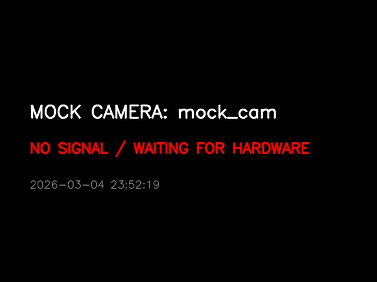

# Universal Vision MCP 👁️

> **「あらゆるカメラを、AI の標準的な『目』と『首』に変える」**

Universal Vision MCP は、USB カメラ（内蔵カメラ）、ネットワークカメラ（RTSP/ONVIF）、さらには仮想カメラ（Mock）を統合し、AI エージェントに「身体性（Embodiment）」を授けるための Model Context Protocol (MCP) サーバーです。

## 🌟 特徴


<br>*(AI が捉える Mock カメラの視界イメージ)*

- **多態的な身体 (Polymorphism)**: USB カメラからプロ仕様の PTZ ネットワークカメラまで、同一のインターフェースでラップします。
- **自己記述する S 式**: Lisp 形式の S 式を用いて、AI 自身に「今の自分の身体能力（首が振れるか、固定か等）」を直感的に理解させます。
- **自律的な探索 (Autonomous Discovery)**: AI が自らローカルネットワークをスキャンし、新しいカメラを見つけ、ユーザーに設定を提案できます。
- **ライブプレビュー**: AI の指示により、ホストマシン上に OpenCV のウィンドウを直接表示・非表示できます。
- **親切な CLI**: `doctor`（診断）や `setup`（対話型設定）サブコマンドを備え、導入のハードルを極限まで下げています。

## 🚀 はじめる

### 1. [uv](https://docs.astral.sh/uv/) のインストール
Python のパッケージ管理ツール `uv` をインストールします（未インストールの場合）。
```bash
curl -LsSf https://astral.sh/uv/install.sh | sh
```

### 2. クローンとセットアップ
```bash
git clone https://github.com/utenadev/universal-vision-mcp
cd universal-vision-mcp
uv sync
```

### 3. ハードウェアの確認
```bash
# ハードウェアの診断と S 式（自己記述）のプレビュー
uv run universal-vision-mcp doctor

# カメラの対話型設定（ネットワークカメラ等を追加する場合）
uv run universal-vision-mcp setup
```

### 4. 実行
```bash
# MCP サーバーの起動
uv run universal-vision-mcp run
```

Claude Desktop などの MCP クライアントから呼び出す場合は、`uv run universal-vision-mcp run` を起動コマンドとして設定してください。

## 🛠 技術スタック

- **Python 3.11+**
- **MCP Python SDK**: Model Context Protocol 準拠。
- **OpenCV (opencv-python)**: 映像キャプチャ、画像処理、プレビュー表示。
- **ONVIF (onvif-zeep-async)**: ネットワークカメラのパン・チルト・ズーム制御。
- **Zeroconf / Scapy**: ネットワークデバイスの自動探索。
- **Typer & Rich**: 美しく使いやすい CLI インターフェース。

## 🧠 設計思想：S 式による自己定義

このサーバーは、ツール一覧を表示する際に以下のような身体記述（S 式）を各ツールの説明文に注入します。

```lisp
(part :id garden_cam :type network :tool see_garden_cam
  :desc "Remote network camera via RTSP.")
(part :id neck_garden_cam :type ptz :tool look_garden_cam
  :desc "Motorized neck for garden_cam. No permission needed.")
```

これにより、LLM は単なる「関数」を呼び出すのではなく、「自分には PTZ 対応の目があり、それを使って周囲を見渡せる」という**身体感覚**を持って行動することが可能になります。

---

## ❤️ Acknowledgments & Respect

このプロジェクトの誕生は、**kmizu (lifemate-ai)** 氏による先駆的な仕事なしにはあり得ませんでした。

- **`embodied-claude`** そして **`familiar-ai`** という、AI に実体（Embodiment）を持たせる試みの衝撃。
- かつてエンジニアが夢見た **Lisp S-式** を通じた AI との対話という、懐かしくも新しいユーザー体験。
- 私たちに「AI と共に生きる」という最高の **アソビ** を教えてくれたことに、心からの感謝を捧げます。

---

## 📜 ライセンス

MIT License - 自由なハックと進化を歓迎します。
